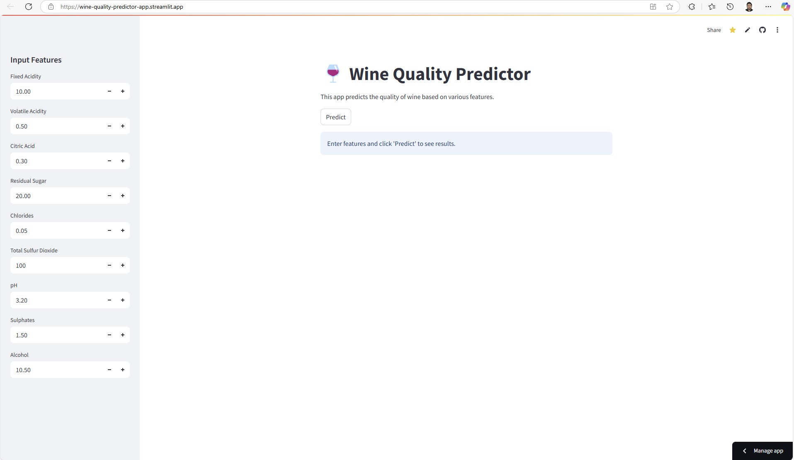
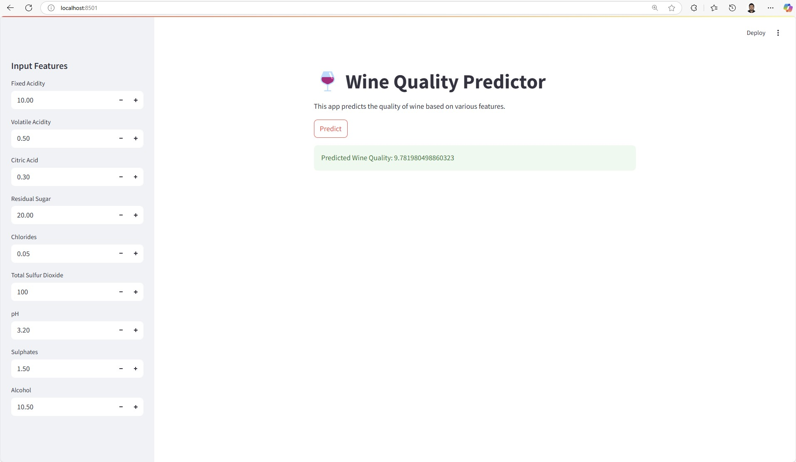
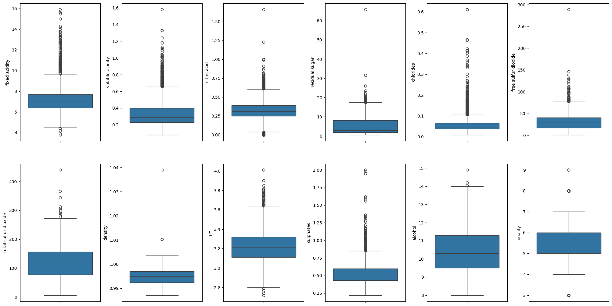
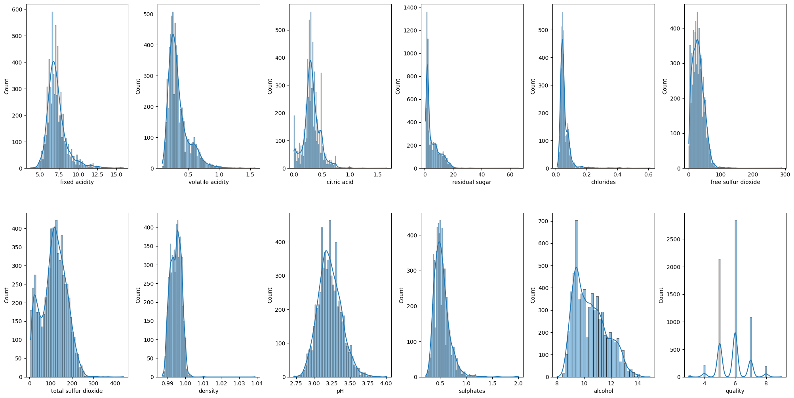
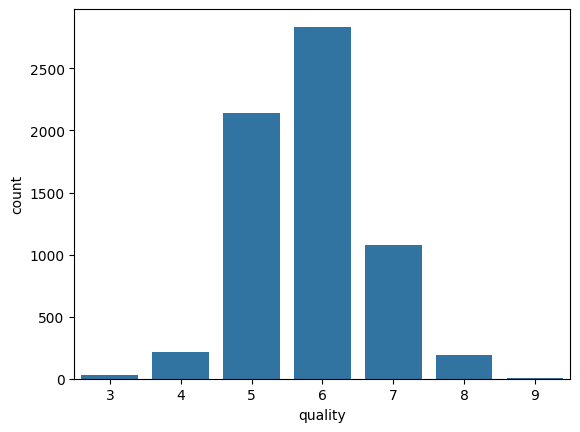
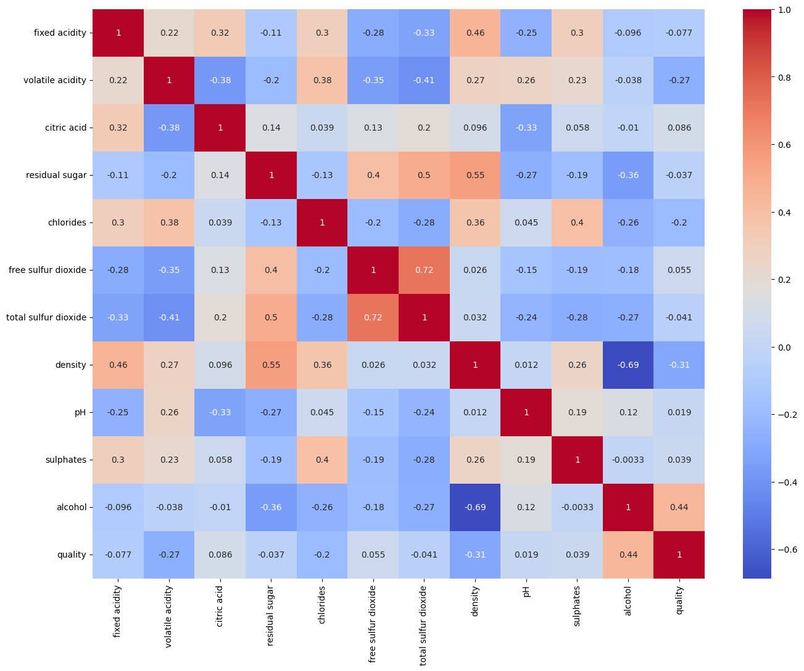

Photo by <a href="https://unsplash.com/@kymellis?utm_content=creditCopyText&utm_medium=referral&utm_source=unsplash">Kym Ellis</a> on <a href="https://unsplash.com/photos/clear-wine-glass-overlooking-orchard-during-daytime-aF1NPSnDQLw?utm_content=creditCopyText&utm_medium=referral&utm_source=unsplash">Unsplash</a>
      
	  


[](https://github.com/ellerbrock/open-source-badges/)

Badge [source](https://shields.io/)

# Wine Quality Predictor App

In this project, we are developing a Streamlit Application that can predict the quality of the wine. This is an end-to-end Machine learning portfolio project that involves Model Development and Model training. The Machine Learning Project is implemented with MLOps and CI/CD pipelines.

Streamlit App link : [https://wine-quality-predictor-app.streamlit.app/](https://wine-quality-predictor-app.streamlit.app/)


## Authors

- [Samith Chimminiyan](https://www.github.com/samithcsachi)

## Table of Contents

- [Authors](#Authors)
- [Table of Contents](#table-of-contents)
- [Problem Statement](#problem-statement)
- [Tech Stack](#tech-stack)
- [Data source](#data-source)
- [Quick glance at the results](#Quick-glance-at-the-results)
- [Lessons learned and recommendation](#lessons-learned-and-recommendations)
- [Limitation and what can be improved](#limitations-and-what-can-be-improved)
- [Work Flows](#workflows)
- [Run Locally](#run-locally)
- [Explore the notebook](#explore-the-notebook)
- [Contribution](#contribution)
- [License](#license)

## Problem Statement 

This app can predict the quality of the wine with a few features like Fixed Acidity, Volatile Acidity, Citric Acid, Residual Sugar, Chlorides, Total Sulfur Dioxide, pH, Sulphates, and Alcohol. 

## Tech Stack

- pandas
- mlflow
- notebook
- numpy
- scikit-learn
- seaborn
- matplotlib
- python-box
- pyYAML
- tqdm
- ensure
- joblib
- types-pyYAML
- streamlit

## Data source

Data Source Link : - [https://www.kaggle.com/datasets/rajyellow46/wine-quality](https://www.kaggle.com/datasets/rajyellow46/wine-quality)

The dataset was downloaded from the UCI Machine Learning Repository.

The two datasets are related to red and white variants of the Portuguese "Vinho Verde" wine. The reference [Cortez et al., 2009]. Due to privacy and logistical issues, only physicochemical (inputs) and sensory (the output) variables are available (e.g., there is no data about grape types, wine brand, wine selling price, etc.).

Attribute Information:


Input variables (based on physicochemical tests):
1. fixed acidity
2. volatile acidity
3. citric acid
4. residual sugar
5. chlorides
6. free sulfur dioxide
7. total sulfur dioxide
8. density
9. pH
10. sulphates
11. alcohol
Output variable (based on sensory data):
12. quality (score between 0 and 10)


## Quick glance at the results

Main Welcome Screen of the Website



Final Results of the Model



Images from EDA










## Lessons learned and recommendations


***Have used ElasticNet for the prediction.***
- Used Dagshub to check the ML Flow and identify the best parameter to be used. 
- As per the analysis using Dagshub have selected  alpha-  0.1 and l1_ratio - 0.3
to get the below results. 


	- rmse 0.8548153376389345
    - mae: 0.6559112271159511
    - r2: 0.07460097151842737


With this project have learned how we use MLflow to identify the best parameters for the model. Also learned to deploy the app in Streamlit. 


## Limitations and what can be improved

We can also use the traditional method of trying different algorithms to identify the best model with hyper-tuning parameters to get a more accurate model, but that might be a  very time-consuming process. 


## Workflows

1. Update config.yaml
2. Update schema.yaml
3. Update params.yaml
4. Update entity
5. Update the configuration manager in the src config
6. Update the components 
7. Update the pipeline
8. Update the main.py
9. Update the app.py


## Run Locally

Initialize git

```bash
git init
```

Clone the project

```bash
git clone https://github.com/samithcsachi/wine-quality-predictor.git
```

Open Anaconda Prompt, change the Directory, and Open VSCODE by typing code.

```bash
cd E:/wine-quality-predictor

```

Create a virtual environment 

```bash
conda create -n wine python==3.12 -y
```

```bash
conda activate wine
```


Install the requirements

```bash
pip install -r requirements.txt
```


```bash
# Finally, run the following command: 
python main.py
```


MLflow

[Documentation](https://mlflow.org/docs/latest/index.html)

dagshub

[dagshub](https://dagshub.com/)

MLFLOW_TRACKING_URI=https://dagshub.com/samithc/wine-quality-predictor.mlflow \
MLFLOW_TRACKING_USERNAME=your_username from dagshub \
MLFLOW_TRACKING_PASSWORD=your_token from dagshub \


Run this to export as env variables in CMD:

```bash

set MLFLOW_TRACKING_URI=https://dagshub.com/samithc/wine-quality-predictor.mlflow

set MLFLOW_TRACKING_USERNAME=your_username from dagshub

set MLFLOW_TRACKING_PASSWORD=your_token from dagshub

```

Run the streamlit app 

```bash

streamlit run app.py

```


## Explore the notebook

GitHub :  [https://github.com/samithcsachi/wine-quality-predictor](https://github.com/samithcsachi/wine-quality-predictor)

## Contribution

Pull requests are welcome! For major changes, please open an issue first to discuss what you would like to change or contribute.

## License

MIT License

Copyright (c) 2025 Samith Chimminiyan

Permission is hereby granted, free of charge, to any person obtaining a copy
of this software and associated documentation files (the "Software"), to deal
in the Software without restriction, including without limitation the rights
to use, copy, modify, merge, publish, distribute, sublicense, and/or sell
copies of the Software, and to permit persons to whom the Software is
furnished to do so, subject to the following conditions:

The above copyright notice and this permission notice shall be included in all
copies or substantial portions of the Software.

THE SOFTWARE IS PROVIDED "AS IS", WITHOUT WARRANTY OF ANY KIND, EXPRESS OR
IMPLIED, INCLUDING BUT NOT LIMITED TO THE WARRANTIES OF MERCHANTABILITY,
FITNESS FOR A PARTICULAR PURPOSE AND NONINFRINGEMENT. IN NO EVENT SHALL THE
AUTHORS OR COPYRIGHT HOLDERS BE LIABLE FOR ANY CLAIM, DAMAGES OR OTHER
LIABILITY, WHETHER IN AN ACTION OF CONTRACT, TORT OR OTHERWISE, ARISING FROM,
OUT OF OR IN CONNECTION WITH THE SOFTWARE OR THE USE OR OTHER DEALINGS IN THE
SOFTWARE.

Learn more about [MIT](https://choosealicense.com/licenses/mit/) license

## Contact
If you have any questions, suggestions, or collaborations in data science, feel free to reach out:
- 📧 Email: [samith.sachi@gmail.com](mailto:samith.sachi@gmail.com)
- 🔗 LinkedIn: [www.linkedin.com/in/samithchimminiyan](https://www.linkedin.com/in/samithchimminiyan)
- 🌐 Website: [www.samithc.com](https://www.samithc.com)


